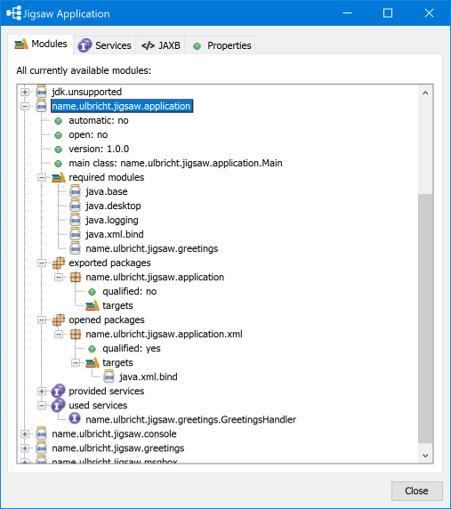

# Jigsaw
Demonstrates the usage of Java module system.

 

## Modules
### application
This is a modularized Swing application that uses some services.
In the user interface this application features a graphical module browser.
It also uses JAXB (which was deprected in Java 9 and removed in Java 11) to demonstrate how to use an alternative.
### greetings
This modules defines a service API that is used by the application to find implementing services.
### console
This module implements the service API with a simple console based handler.
### msgbox
This module provides some service implementations for AWT and Swing.

## Background
The project is created with Open JDK 10 and Maven. The goal is to provide a blueprint for the configuration of a modularized application up to the generation of an executable image with a custom JRE.

After the Maven build (`mvn clean package`) has completed successfully you will find the executable application in `application/target/runimage`. There you can execute `bin/JigsawApplication`. Or you just use the `runme.cmd` in the root forlder.

As soon as Java 11 is finally released, I will try to update this project to use an alternative to the current JAXB implementation.

Thanks to [qualitype](http://qualitype.de) for inspiration.

## To do
* Set a version number for the non-application modules too. For now it looks like specifying a main class is required by the `jar` tool. But those modules have no main class... [see](https://bugs.openjdk.java.net/browse/JDK-8210454)
